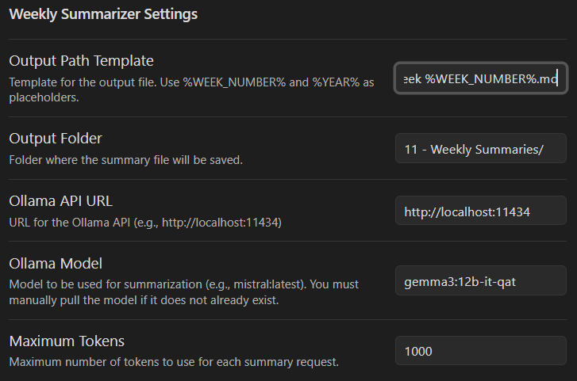

# weekly-summary
Weekly summary using AI, an Obsidian plugin. Requires [Ollama](https://ollama.com/) to run the model
locally. 

## Features

- Automatically generates weekly summaries of your notes using AI.
- Integrates seamlessly with Obsidian.
- Customizable summary templates.
- Supports manual and scheduled summary generation.

## Usage

- Open the command palette and search for `Generate Weekly Summary`.
- The plugin will analyze your notes from the past week and create a summary note.
- Configure summary options in the plugin settings.

## Configuration

- Access plugin settings via Obsidian settings > Community Plugins > Weekly Summarizer.
- Set your preferred summary template and AI options.

## Requirements

- Obsidian v1.0.0 or higher.
- Ollama running locally

## License

GNU General Public License v3.0
